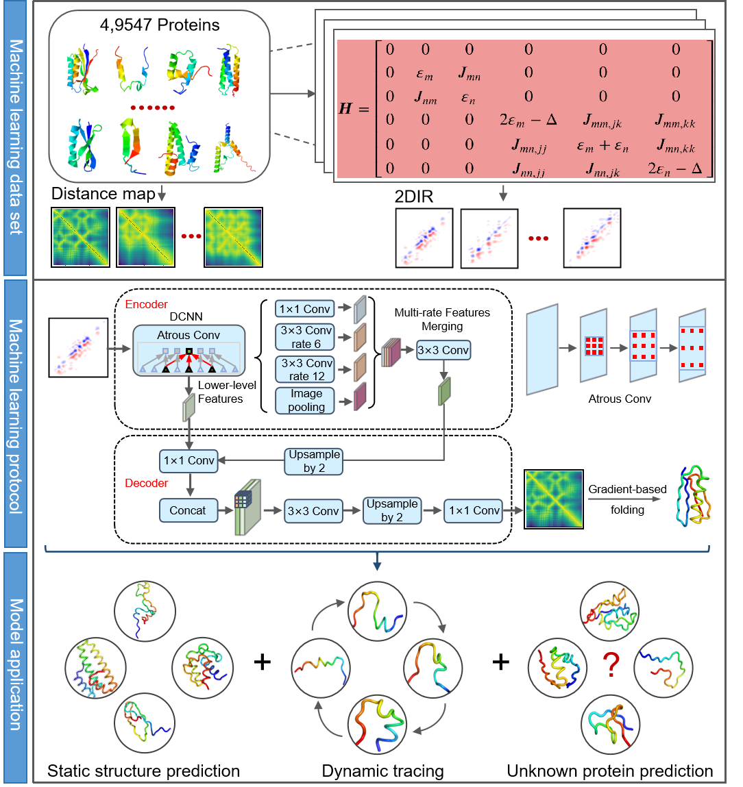

# 2DIR
2DIR: Predicting protein dynamic structures using two-dimensional infrared spectroscopy, with unknown structures.


## Requirements
Operating System: Linux (Recommended)  
No non-standard hardware is required.

## Install Dependencies
```bash
conda create -n 2DIR python=3.8
conda install pytorch torchvision torchaudio cudatoolkit=11.3 -c pytorch
conda activate 2DIR

pip install -r ./install/requirements.txt

```


## Quick Start

First, you need to download the training dataset. You can download it from [this link](https://zenodo.org/records/13382753)  (it's quite large, 1.1GB) and save it under the `data` directory.

The validation dataset link is [this link](https://zenodo.org/records/13382753). 

You may manually modify the parameters in `model/main.py`.

## Training
Before training begins, the protein residue distance matrix needs to be padded to ensure uniform size, which facilitates model processing, accelerates training, and so on. The padding code can be found in the `helper_scripts` directory and can be modified as needed.

### Known Length Protein
```bash
bash train.sh
```

### Unknown Length Protein
```bash
bash train_unknown_protein.sh
```
## Inference
After inference is complete, the predicted results need to be trimmed based on the protein length, following the format provided in `data/output.txt`.
### Known Length Protein
```bash
bash test.sh
```
### Unknown Length Protein
For proteins with unknown lengths, you need to run `model/pre_length.py` to predict the protein length, and then refer to the scripts in the `helper_scripts` directory for trimming and processing.
```bash
bash test_len.py
```


To generate the protein backbone structure from the protein residue distance matrix, please use the gradient descent algorithm available in the `PyRosetta` protocols, providing the predicted residue distances from the model and constraints from `residue_constants.py`.

For obtaining the amino acid sequence of unknown proteins, it is recommended to use the backbone structure as input for `ProteinMPNN`. The model typically converges after around 300 epochs.
